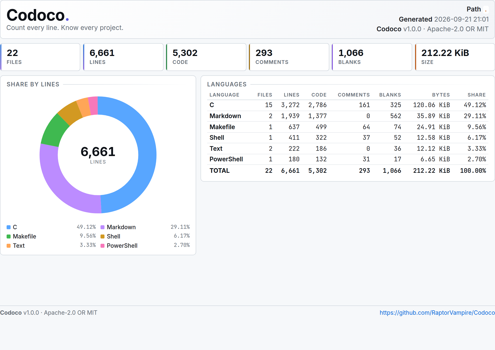

<div align="center">

# 📊 Codoco

**Count every line. Know every project.**

A fast, dependency-free, cross-platform source code line counter written in C.  
Codoco scans your project, detects languages, classifies lines as code / comments / blanks, and produces beautiful terminal, JSON, CSV, XML, or HTML reports.

[](https://github.com/RaptorVampire/Codoco/actions/workflows/ci.yml)
[](https://github.com/RaptorVampire/Codoco/actions/workflows/release.yml)
[](https://github.com/RaptorVampire/Codoco/releases)
[](HOW-TO-BUILD-MYSELF.md)
[](#-license)
[](https://en.wikipedia.org/wiki/C_(programming_language))
[](#️-supported-platforms)

<a href="./Screenshot.png">
  
</a>

**📸 HTML report generated from the Codoco repository itself.**

📖 Looking for manual installation and build instructions?  
See **[HOW-TO-BUILD-MYSELF.md](HOW-TO-BUILD-MYSELF.md)**

If Codoco saves you time, please consider giving it a ⭐ on GitHub!

</div>

---

## 📚 Table of Contents

- [🧭 Overview](#-overview)
- [✨ Why Codoco?](#-why-codoco)
- [🚀 Features](#-features)
- [⚡ Quick Start](#-quick-start)
- [📥 Installation](#-installation)
- [🛠️ Building From Source](#️-building-from-source)
- [🧪 Usage Examples](#-usage-examples)
- [📤 Output Formats](#-output-formats)
- [⌨️ Command-Line Reference](#️-command-line-reference)
- [🧠 Language Detection](#-language-detection)
- [🗣️ Supported Languages](#️-supported-languages)
- [🗂️ File Filtering and Traversal](#️-file-filtering-and-traversal)
- [🔢 How Counting Works](#-how-counting-works)
- [🖥️ Supported Platforms](#️-supported-platforms)
- [📁 Project Layout](#-project-layout)
- [🤝 Contributing](#-contributing)
- [📜 License](#-license)
- [⭐ Star / Support](#-star--support)

---

## 🧭 Overview

**Codoco** is a lightweight, high-performance code statistics tool designed to give you an instant, clear picture of any codebase.

Point it at a directory, a set of files, or a whole repository, and Codoco will:

- 🔎 Recursively scan source files
- 🧠 Detect programming languages by extension, filename, or shebang
- 🧮 Count lines, code lines, comment lines, blank lines, and bytes
- 🚫 Skip binary files and common build/dependency directories
- 📦 Produce polished reports for humans and machines

Codoco is especially useful for:

- 📈 Repository size analysis
- 📊 CI dashboards
- 📝 Documentation generation
- 🔍 Codebase audits
- 🌐 Language distribution reports
- 📄 Per-file inspection
- 🧾 Quick statistics for pull requests or project reviews

---

## ✨ Why Codoco?

Many line counters exist — but Codoco aims to be:

### ⚡ Fast
Written in pure C with minimal overhead, Codoco is designed for speed and low memory usage.

### 📦 Dependency-Free Runtime
The final binary only needs the standard C library and POSIX-compatible system interfaces. No Python, Node.js, Ruby, or runtime dependencies are required.

### 🌍 Cross-Platform
Codoco supports Linux, macOS, Windows, and Termux across many CPU architectures.

### 🎨 Beautiful Output
From clean terminal tables to polished HTML reports with charts, Codoco makes statistics readable and shareable.

### 🧠 Smart Detection
Codoco does not only look at extensions. It also understands special filenames like `Makefile`, `Dockerfile`, `CMakeLists.txt`, `Gemfile`, `.gitignore`, and more. It can even inspect shebang lines and apply a C/C++ header heuristic.

### 🔧 Scriptable
JSON, CSV, and XML outputs make Codoco easy to integrate into tooling, dashboards, and automation pipelines.

---

## 🚀 Features

- 🌐 **180+ built-in language definitions**
- 🖥️ **Terminal-first design**
  - Adaptive table layout based on terminal width
  - Unicode box drawing with ASCII fallback
  - Optional color output
- 📤 **Multiple output formats**
  - Table
  - JSON
  - CSV
  - XML
  - HTML
- 🌐 **HTML reports**
  - Dark and light themes
  - Responsive layout
  - Donut chart for language distribution
  - Print-friendly styling
- 📄 **Per-file reporting**
- 🔀 **Sorting and limiting**
  - Sort by name, files, lines, code, comments, blanks, or bytes
  - Ascending/descending order
  - Top-N results
- 🎯 **Powerful filtering**
  - Include/exclude languages
  - Include/exclude extensions
  - Exclude directories with glob patterns
  - Minimum/maximum file size filters
- 🧹 **Smart scanning behavior**
  - Binary file detection
  - Default ignore list for common build and dependency directories
  - Hidden file control
  - Symlink traversal control
  - Depth-limited recursion
- 📥 **Robust installer**
  - One-line install for Unix-like systems
  - PowerShell installer for Windows
  - Checksum verification support

---

## ⚡ Quick Start

### Count the current directory

```bash
codoco .
```

### Show only the top 10 languages by code lines

```bash
codoco --sort=code --top=10 .
```

### Generate HTML reports

```bash
codoco --html -o report.html .
```

This produces theme-specific HTML files such as:

```text
report-dark.html
report-light.html
```

### Export JSON

```bash
codoco --json . > codoco.json
```

### Per-file report sorted by bytes

```bash
codoco --by-file --sort=bytes --order=desc .
```

### Scan only selected languages

```bash
codoco --include-lang="C,C++,Python,Shell" .
```

### Exclude directories

```bash
codoco --exclude-dir="vendor,third_party,docs" .
```

---

## 📥 Installation

Codoco provides simple installers for Unix-like systems and Windows.

For manual installation, release extraction, building from source, Make usage, and troubleshooting, see:

👉 **[HOW-TO-BUILD-MYSELF.md](HOW-TO-BUILD-MYSELF.md)**

---

### 🐧 Linux / 🍎 macOS / 📱 Termux

Install the latest release:

```bash
curl -fsSL https://raw.githubusercontent.com/RaptorVampire/Codoco/main/install.sh | sh
```

The installer will:

1. 🧭 Detect your OS and architecture
2. ⬇️ Download the correct release artifact
3. ✅ Verify checksum when available
4. 📂 Install the binary into `$HOME/.local/bin` by default
5. 🛤️ Update your shell PATH if possible

#### Installer environment variables

| Variable | Default | Description |
|---|---:|---|
| `VERSION` | `latest` | Install a specific tag, e.g. `v1.0.0` |
| `PREFIX` | `$HOME/.local` | Installation prefix |
| `BINDIR` | `$PREFIX/bin` | Binary destination directory |
| `YES=1` | disabled | Skip confirmation prompt |
| `FORCE=1` | disabled | Reinstall even if already installed |
| `UNINSTALL=1` | disabled | Remove Codoco |
| `NO_PATH=1` | disabled | Do not modify shell rc files |
| `NO_VERIFY=1` | disabled | Skip checksum verification |

#### Examples

Install a specific version:

```bash
curl -fsSL https://raw.githubusercontent.com/RaptorVampire/Codoco/main/install.sh | VERSION=v1.0.0 sh
```

Install system-wide:

```bash
curl -fsSL https://raw.githubusercontent.com/RaptorVampire/Codoco/main/install.sh | sudo PREFIX=/usr/local BINDIR=/usr/local/bin sh
```

Assume yes and skip PATH modification:

```bash
curl -fsSL https://raw.githubusercontent.com/RaptorVampire/Codoco/main/install.sh | YES=1 NO_PATH=1 sh
```

Uninstall:

```bash
curl -fsSL https://raw.githubusercontent.com/RaptorVampire/Codoco/main/install.sh | UNINSTALL=1 sh
```

---

### 🪟 Windows PowerShell

Install the latest release:

```powershell
irm https://raw.githubusercontent.com/RaptorVampire/Codoco/main/install.ps1 | iex
```

By default, Codoco is installed to:

```text
%LOCALAPPDATA%\Programs\Codoco
```

and added to your user PATH.

#### PowerShell installer options

| Option | Description |
|---|---|
| `-Version` | Install a specific release tag |
| `-InstallDir` | Installation directory |
| `-Uninstall` | Remove Codoco |
| `-NoPath` | Do not modify PATH |
| `-Force` | Reinstall even if already installed |
| `-NoVerify` | Skip checksum verification |

Open a new terminal after installation so PATH changes take effect.

---

## 🛠️ Building From Source

If you want to compile Codoco yourself, install it manually, use Make targets, build packages, or debug build problems, read the full guide here:

👉 **[HOW-TO-BUILD-MYSELF.md](HOW-TO-BUILD-MYSELF.md)**

That guide includes:

- 🧱 Building with `make`
- 🧰 Direct compilation without Make
- 📥 Manual release installation
- 📦 Local `.deb` / `.rpm` packaging
- 🧪 Smoke tests
- 🩹 Troubleshooting

---

## 🧪 Usage Examples

### Basic scan

```bash
codoco .
```

### Scan multiple paths

```bash
codoco src include tests
```

### Show top 15 languages by total lines

```bash
codoco --top=15 .
```

### Sort by number of files

```bash
codoco --sort=files --order=desc .
```

### Show per-file statistics

```bash
codoco --by-file .
```

### Largest files by bytes

```bash
codoco --by-file --sort=bytes --top=25 .
```

### Count only C, C++, and Python

```bash
codoco --include-lang="C,C++,Python" .
```

### Exclude Markdown and JSON

```bash
codoco --exclude-lang="Markdown,JSON" .
```

### Include only selected extensions

```bash
codoco --include-ext="c,h,cpp,hpp" .
```

### Exclude directories with glob patterns

```bash
codoco --exclude-dir="build,*cache*,third_party" .
```

### Include hidden files

```bash
codoco --hidden .
```

### Limit recursion depth

```bash
codoco --depth=2 .
```

### Disable recursion

```bash
codoco --no-recursive .
```

### Follow symbolic links

```bash
codoco --follow .
```

### Force every file to be treated as Python

```bash
codoco --force-lang=Python .
```

### ASCII-only terminal output

Useful for legacy terminals or CI logs:

```bash
codoco --ascii --no-color .
```

### Force color output

```bash
codoco --color .
```

### Hide bars and percentages

```bash
codoco --no-bar --no-percent .
```

### Quiet mode

```bash
codoco --quiet .
```

---

## 📤 Output Formats

Codoco supports five output formats.

| Format | Best For |
|---|---|
| `table` | Human-readable terminal output |
| `json` | APIs, dashboards, tooling |
| `csv` | Spreadsheets and data analysis |
| `xml` | Legacy integrations and structured reports |
| `html` | Shareable visual reports |

---

### 🖥️ Terminal Table

The default output is an adaptive terminal table.

It includes:

- 🏷️ Project banner
- 📈 Scan statistics
- 📋 Language table
- ➕ Total summary
- 📊 Optional language distribution bars
- 📄 Optional per-file report

The terminal renderer is width-aware:

- It avoids wrapping
- It truncates long values safely
- It falls back to ASCII when requested
- It supports Unicode box drawing when available

Example:

```bash
codoco .
```

---

### 🧾 JSON

Generate structured JSON output:

```bash
codoco --json .
```

Example structure:

```json
{
  "tool": "Codoco",
  "version": "1.0.0",
  "url": "https://github.com/RaptorVampire/Codoco",
  "license": "Apache-2.0 OR MIT",
  "summary": {
    "files": 123,
    "lines": 45678,
    "code": 34567,
    "comments": 6789,
    "blanks": 4321,
    "bytes": 1234567
  },
  "languages": [
    {
      "name": "C",
      "files": 40,
      "lines": 20000,
      "code": 15000,
      "comments": 3000,
      "blanks": 2000,
      "bytes": 700000
    }
  ]
}
```

With `--by-file`, a `files` array is also included:

```bash
codoco --json --by-file .
```

---

### 📊 CSV

Generate CSV output:

```bash
codoco --csv .
```

Default columns:

```text
Language,Files,Lines,Code,Comments,Blanks,Bytes,Percent
```

With `--by-file`, an additional per-file section is emitted:

```text
Path,Language,Lines,Code,Comments,Blanks,Bytes
```

---

### 📰 XML

Generate XML output:

```bash
codoco --xml .
```

Example:

```xml
<?xml version="1.0" encoding="UTF-8"?>
<codoco tool="Codoco" version="1.0.0" url="https://github.com/RaptorVampire/Codoco" license="Apache-2.0 OR MIT">
  <summary files="123" lines="45678" code="34567" comments="6789" blanks="4321" bytes="1234567"/>
  <languages>
    <language name="C" files="40" lines="20000" code="15000" comments="3000" blanks="2000" bytes="700000" percent="43.79"/>
  </languages>
</codoco>
```

---

### 🌐 HTML Report

Codoco can generate a polished standalone HTML report.

```bash
codoco --html .
```

By default, both dark and light themes are generated:

```text
codoco-report-dark.html
codoco-report-light.html
```

Specify a base output name:

```bash
codoco --html -o report.html .
```

This produces:

```text
report-dark.html
report-light.html
```

Choose a theme:

```bash
codoco --html --theme=dark .
codoco --html --theme=light .
codoco --html --theme=both .
```

#### HTML report features

- 🎨 Modern dashboard-like layout
- 🧮 Summary cards for files, lines, code, comments, blanks, and size
- 🍩 SVG donut chart for language share
- 📌 Legend with percentages
- 📋 Full language table
- 🌗 Dark and light themes
- 📱 Responsive mobile layout
- 🖨️ Print-friendly CSS

This makes Codoco especially useful for:

- 📖 Project documentation
- 📊 Internal dashboards
- 🔍 Code review summaries
- 🌐 Open-source repository reports
- 📤 Shareable statistics without installing additional tools

---

## ⌨️ Command-Line Reference

### General

```text
Usage: codoco [OPTIONS] [PATH...]
```

If no path is given, Codoco scans the current directory.

---

### Output options

| Option | Description |
|---|---|
| `--format=FMT` | Output format: `table`, `json`, `csv`, `xml`, `html` |
| `--json` | Shortcut for `--format=json` |
| `--csv` | Shortcut for `--format=csv` |
| `--xml` | Shortcut for `--format=xml` |
| `--html` | Shortcut for `--format=html` |
| `-o, --output=FILE` | Base output path for HTML reports |
| `--theme=MODE` | HTML theme: `dark`, `light`, `both` |
| `--by-file` | Include per-file report |
| `--no-bar` | Hide bar charts in terminal output |
| `--no-percent` | Hide percentages |
| `--no-total` | Hide total row |
| `--no-header` | Hide table headers |
| `--ascii` | ASCII-only output |
| `--no-color` | Disable ANSI colors |
| `--color` | Force ANSI colors |
| `--top=N` | Show only top N entries |
| `-q, --quiet` | Suppress non-essential messages |

---

### Sorting options

| Option | Description |
|---|---|
| `--sort=KEY` | Sort key: `name`, `files`, `lines`, `code`, `comments`, `blanks`, `bytes` |
| `--order=ORD` | Sort order: `asc` or `desc` |

Default:

```text
--sort=lines --order=desc
```

---

### Filtering options

| Option | Description |
|---|---|
| `--include-lang=L` | Only include languages in comma-separated list |
| `--exclude-lang=L` | Exclude languages in comma-separated list |
| `--include-ext=L` | Only include extensions in comma-separated list |
| `--exclude-ext=L` | Exclude extensions in comma-separated list |
| `--exclude-dir=L` | Exclude directory names using comma-separated globs |
| `--max-file-size=N` | Skip files larger than N bytes |
| `--min-file-size=N` | Skip files smaller than N bytes |
| `--force-lang=LANG` | Treat every scanned file as the given language |

---

### Traversal options

| Option | Description |
|---|---|
| `-r, --recursive` | Recursive scan, enabled by default |
| `--no-recursive` | Disable recursion |
| `-d, --depth=N` | Maximum recursion depth |
| `--hidden` | Include hidden files and directories |
| `--follow` | Follow symbolic links |

---

### Information options

| Option | Description |
|---|---|
| `-h, -?, -help, --help` | Show help |
| `-v, --version` | Show version |
| `--license` | Show license information |
| `--list-langs`, `--langs` | List supported languages |

---

## 🧠 Language Detection

Codoco uses a layered detection strategy.

### Detection order

1. 🎯 **Forced language**
   - If `--force-lang` is used, Codoco applies it.

2. 📛 **Filename rules**
   - Special files are recognized by name.
   - Examples:
     - `Makefile`
     - `Dockerfile`
     - `CMakeLists.txt`
     - `Gemfile`
     - `Rakefile`
     - `package.json`
     - `Cargo.toml`
     - `go.mod`
     - `.gitignore`
     - `.editorconfig`
     - `Vagrantfile`
     - `Jenkinsfile`

3. 🧩 **File extension**
   - Most languages are detected by extension.
   - Extension matching is case-insensitive.

4. 🧪 **C/C++ header heuristic**
   - `.h` files are treated as C by default.
   - If a sibling C++ source file exists, Codoco reclassifies the header as C++.

5. 🐑 **Shebang detection**
   - If no language is found, Codoco checks the first line for a shebang.
   - Examples:
     - `#!/usr/bin/env python3`
     - `#!/bin/bash`
     - `#!/usr/bin/env node`

6. 📄 **Fallback**
   - Text-like files without a recognized language are treated as `Text`.

---

## 🗣️ Supported Languages

Codoco ships with **180+ built-in language definitions**.

You can always list them locally with:

```bash
codoco --list-langs
```

### Broad language coverage includes

#### 🧱 Systems languages
- C
- C++
- Rust
- Zig
- D
- Ada
- Pascal
- Fortran
- Assembly

#### 🧰 Application languages
- Python
- Ruby
- JavaScript
- TypeScript
- Java
- Kotlin
- Scala
- C#
- Go
- PHP
- Dart
- Lua
- Perl
- Raku

#### 🌐 Web and markup
- HTML
- CSS
- SCSS
- SASS
- LESS
- Markdown
- reStructuredText
- AsciiDoc
- XML
- JSON
- YAML
- TOML

#### 🐚 Shell and scripting
- Shell
- Bash
- Zsh
- Fish
- PowerShell
- Batch
- VBScript
- AWK
- Sed
- Tcl

#### 📈 Data and science
- R
- MATLAB
- Octave
- Julia
- Wolfram
- SAS
- Stata
- SPSS

#### ⚙️ Configuration and infrastructure
- Dockerfile
- Makefile
- CMake
- Meson
- Bazel
- Gradle
- Terraform
- HCL
- Nix
- Puppet
- INI
- TOML
- YAML

#### 🧮 Hardware and embedded
- Verilog
- SystemVerilog
- VHDL
- CUDA
- OpenCL
- GLSL
- HLSL

#### 🧬 Other special formats
- SQL
- GraphQL
- Protocol Buffers
- Thrift
- LLVM IR
- WebAssembly
- COBOL
- Lisp
- Haskell
- OCaml
- Erlang
- Elixir
- Prolog

The authoritative list is always available via:

```bash
codoco --list-langs
```

---

## 🗂️ File Filtering and Traversal

Codoco is designed to avoid noise.

### Default ignored directories

By default, Codoco skips common generated and dependency directories such as:

- `.git`
- `.hg`
- `.svn`
- `node_modules`
- `vendor`
- `__pycache__`
- `.pytest_cache`
- `.mypy_cache`
- `.venv`
- `venv`
- `target`
- `build`
- `dist`
- `out`
- `bin`
- `obj`
- `.idea`
- `.vscode`
- `.gradle`
- `.cargo`
- `DerivedData`
- `.next`
- `.nuxt`
- `coverage`

### Binary files

Codoco automatically skips many binary file types, including:

- 🧱 Executables and object files
- 🗜️ Archives
- 🖼️ Images
- 🎵 Audio/video
- 🔤 Fonts
- 📚 Documents
- 🗃️ Databases
- 📦 Compiled artifacts

Additional binary detection is performed by scanning file contents for NUL bytes.

### Hidden files

Hidden files and directories are excluded by default.

Include them with:

```bash
codoco --hidden .
```

### Symlinks

Symlinks are not followed by default.

Follow them with:

```bash
codoco --follow .
```

---

## 🔢 How Counting Works

Codoco uses a lightweight line classification engine.

Each line is classified as one of:

- 💻 **Code**
- 💬 **Comment**
- ⬜ **Blank**

### Counting rules

- A line containing only whitespace is counted as **blank**.
- A line containing code is counted as **code**, even if it also contains a trailing comment.
- A line containing only comment syntax is counted as **comment**.
- Block comments are recognized where supported by the language definition.
- String literals and escapes are considered during classification.
- Language-specific line comment markers are respected.
- Block comment start/end markers are respected.

### Example

For C-like code:

```c
int main(void) {
    // start program
    return 0;
}
```

Typical classification:

```text
int main(void) {   -> code
// start program   -> comment
return 0;          -> code
}                  -> code
```

### Important note

Codoco is not a full compiler or parser.  
It uses fast, practical heuristics that are well suited for project statistics, trend reporting, and repository analysis.

---

## 🖥️ Supported Platforms

Codoco targets a wide range of operating systems and architectures.

### Official release targets

#### 🐧 Linux

- `linux-x86_64`
- `linux-i686`
- `linux-aarch64`
- `linux-armv7`
- `linux-riscv64`
- `linux-x86_64-static`

#### 🍎 macOS

- `macos-x86_64`
- `macos-arm64`

#### 🪟 Windows

- `windows-x86_64`
- `windows-i686`

### Additional environments

Codoco also works in:

- 📱 Termux on Android
- 🧰 MSYS2 / MinGW environments
- 📦 Containers and minimal Linux systems

---

## 📁 Project Layout

```text
Codoco/
├── include/            # Public headers
│   ├── codoco.h
│   ├── languages.h
│   ├── options.h
│   ├── printer.h
│   ├── scanner.h
│   ├── stats.h
│   ├── utils.h
│   └── version.h
├── src/                # Implementation
│   ├── languages.c
│   ├── main.c
│   ├── options.c
│   ├── printer.c
│   ├── scanner.c
│   ├── stats.c
│   └── utils.c
├── install.sh          # Unix installer
├── install.ps1         # Windows installer
├── Makefile
├── Screenshot.png      # HTML report preview shown above
├── HOW-TO-BUILD-MYSELF.md
├── LICENSE-APACHE
└── LICENSE-MIT
```

---

## 🤝 Contributing

Contributions are very welcome!

You can help by:

- 🐞 Reporting bugs
- 💡 Suggesting features
- 📝 Improving documentation
- 🌐 Adding language definitions
- 🔧 Fixing edge cases in counting logic
- 📦 Improving installers and packaging

Before submitting a pull request, please read the build guide if your change affects compilation or packaging:

👉 **[HOW-TO-BUILD-MYSELF.md](HOW-TO-BUILD-MYSELF.md)**

### Suggested checks before submitting a PR

```bash
make clean
make CFLAGS+="-Werror"
./codoco --no-color --ascii .
```

If you add or modify counting behavior, please include practical examples of before/after behavior in your pull request.

---

## 📜 License

Codoco is dual-licensed.

You may use it under either:

1. **Apache License, Version 2.0**
2. **MIT License**

SPDX identifier:

```text
Apache-2.0 OR MIT
```

Full license texts are provided in:

- `LICENSE-APACHE`
- `LICENSE-MIT`

---

## ⭐ Star / Support

If Codoco helps you understand your projects faster, please consider starring the repository.

Your star helps the project grow, motivates continued development, and helps others discover Codoco.

<div align="center">

**If you find Codoco useful, please ⭐ the repo!**

[https://github.com/RaptorVampire/Codoco](https://github.com/RaptorVampire/Codoco)

</div>